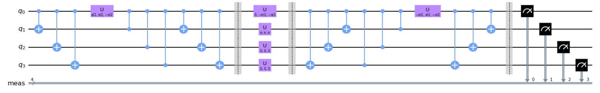

### Solving the Diner’s Dilemma Game

  

This project focuses on solving **The Diner’s Dilemma Game** with four players by leveraging quantum computing. The dilemma is overcome using a quantum strategy that lies between the *Pareto Optimal Point* and the *Nash Equilibrium Point*. This quantum strategy maximizes individual scores without affecting the scores or strategies of the other players. It takes advantage of quantum phenomena, such as superposition and entanglement, providing quantum supremacy over classical strategies.

A quantum circuit was designed to simulate the Diner’s Dilemma Game environment using Qiskit tools. Multiple simulations of potential quantum strategies were conducted to test various proposed hypotheses.

**Method I**: Classical Model  
**Method II**: Quantum Model  

**Python Stack**: sympy, numpy, IPython, matplotlib, qiskit, math, pandas
